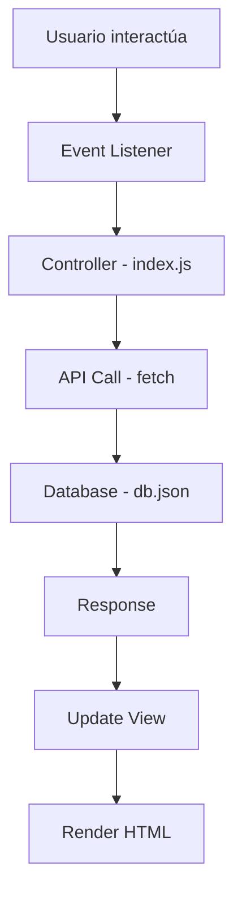

# 📚 Documentación Técnica - SPA Events App

## 🏗️ Arquitectura del Sistema

### Patrón de Diseño Implementado

La aplicación sigue un patrón **MVC (Model-View-Controller)** simplificado adaptado para JavaScript vanilla:

```
┌─────────────────┐    ┌─────────────────┐    ┌─────────────────┐
│      VIEW       │    │   CONTROLLER    │    │      MODEL      │
│                 │    │                 │    │                 │
│  app/views/     │◄──►│    index.js     │◄──►│   db.json       │
│  *.js           │    │                 │    │   auth.js       │
└─────────────────┘    └─────────────────┘    └─────────────────┘
```

### Flujo de Datos



## 🔧 Componentes Principales

### 1. Sistema de Routing (`index.js`)

```javascript
/**
 * Router principal que maneja la navegación SPA
 */
function router() {
  const user = getCurrentUser();
  let path = window.location.hash.replace('#', '');

  // Protección de rutas
  if (!user && path !== '/login' && path !== '/register') {
    navigate('/login');
    return;
  }

  // Routing basado en roles
  if (user && user.role === 'admin') {
    // Rutas de administrador
  } else if (user && user.role === 'visitor') {
    // Rutas de visitante
  }
}
```

**Características:**
- ✅ Navegación basada en hash (#)
- ✅ Protección de rutas por autenticación
- ✅ Control de acceso por roles
- ✅ Redirección automática

### 2. Módulo de Autenticación (`auth.js`)

```javascript
/**
 * Obtiene el usuario actual desde localStorage
 */
export function getCurrentUser() {
  try {
    const user = localStorage.getItem("user");
    return user ? JSON.parse(user) : null;
  } catch (error) {
    console.error('Error al obtener usuario:', error);
    return null;
  }
}

/**
 * Valida las credenciales del usuario
 */
export async function validateCredentials(username, password) {
  try {
    const response = await fetch('http://localhost:3000/users');
    const users = await response.json();
    
    return users.find(
      user => user.username === username && user.password === password
    ) || null;
  } catch (error) {
    console.error('Error al validar credenciales:', error);
    return null;
  }
}
```

**Funcionalidades:**
- ✅ Gestión de sesión con localStorage
- ✅ Validación de credenciales
- ✅ Verificación de roles
- ✅ Manejo de errores

### 3. Gestión de Eventos

#### Crear Evento
```javascript
async function handleCreateEvent(formData) {
  const newEvent = {
    name: formData.get('name'),
    description: formData.get('description'),
    date: formData.get('date'),
    capacity: parseInt(formData.get('capacity')),
    image: formData.get('image') || ''
  };

  try {
    const response = await fetch(`${API_BASE_URL}/events`, {
      method: 'POST',
      headers: { 'Content-Type': 'application/json' },
      body: JSON.stringify(newEvent)
    });

    if (!response.ok) {
      throw new Error('Error al crear evento');
    }

    alert('Evento creado exitosamente');
    navigate('/dashboard');
  } catch (error) {
    console.error('Error al crear evento:', error);
    alert('Error al crear el evento');
  }
}
```

#### Sistema de Inscripciones
```javascript
async function handleEnrollment(eventId) {
  const user = getCurrentUser();
  
  try {
    // Verificar disponibilidad
    const eventResponse = await fetch(`${API_BASE_URL}/events/${eventId}`);
    const event = await eventResponse.json();

    if (event.capacity <= 0) {
      alert('¡Evento agotado!');
      return;
    }

    // Reducir capacidad
    await fetch(`${API_BASE_URL}/events/${eventId}`, {
      method: 'PATCH',
      headers: { 'Content-Type': 'application/json' },
      body: JSON.stringify({ capacity: event.capacity - 1 })
    });

    // Crear inscripción
    await fetch(`${API_BASE_URL}/enrollments`, {
      method: 'POST',
      headers: { 'Content-Type': 'application/json' },
      body: JSON.stringify({
        userId: user.id,
        eventId: event.id
      })
    });

    alert('¡Inscripción exitosa!');
    loadVisitorEvents();
  } catch (error) {
    console.error('Error en inscripción:', error);
    alert('Error al inscribirse en el evento');
  }
}
```

## 🎨 Sistema de Vistas

### Estructura de una Vista

```javascript
// Ejemplo: app/views/login.js
export default function Login() {
  return `
    <div class="login-wrapper">
      <h2>Iniciar Sesión</h2>
      <form id="loginForm" class="login-form">
        <div class="form-group">
          <label for="username">Usuario</label>
          <input type="text" name="username" id="username" required>
        </div>
        <div class="form-group">
          <label for="password">Contraseña</label>
          <input type="password" name="password" id="password" required>
        </div>
        <button type="submit">Ingresar</button>
      </form>
    </div>
  `;
}
```

**Características:**
- ✅ Funciones que retornan HTML como strings
- ✅ IDs únicos para event listeners
- ✅ Estructura semántica
- ✅ Accesibilidad integrada

### Renderizado de Vistas

```javascript
/**
 * Renderiza una vista en el contenedor principal
 */
function render(view) {
  const appContainer = document.getElementById('app');
  if (appContainer) {
    appContainer.innerHTML = view;
  }
}
```

## 🔄 Gestión de Estado

### Estado Global (localStorage)

```javascript
// Guardar usuario
localStorage.setItem('user', JSON.stringify({
  id: 1,
  username: 'admin',
  role: 'admin'
}));

// Obtener usuario
const user = JSON.parse(localStorage.getItem('user'));

// Limpiar sesión
localStorage.removeItem('user');
```

### Estado Local (Variables)

```javascript
// Configuración de la API
const API_BASE_URL = 'http://localhost:3000';

// Estado de carga
let isLoading = false;

// Datos en memoria
let currentEvents = [];
```

## 🛡️ Seguridad Implementada

### 1. Validación de Entrada

```javascript
// Validación básica de formularios
function validateEventData(data) {
  const errors = [];
  
  if (!data.name || data.name.length < 3) {
    errors.push('El nombre debe tener al menos 3 caracteres');
  }
  
  if (!data.date || new Date(data.date) < new Date()) {
    errors.push('La fecha debe ser futura');
  }
  
  if (!data.capacity || data.capacity <= 0) {
    errors.push('La capacidad debe ser mayor a 0');
  }
  
  return errors;
}
```

### 2. Protección de Rutas

```javascript
// Verificación de autenticación
if (!user && path !== '/login' && path !== '/register') {
  navigate('/login');
  return;
}

// Verificación de roles
if (user && user.role === 'admin') {
  // Acceso a rutas de administrador
} else if (user && user.role === 'visitor') {
  // Acceso a rutas de visitante
}
```

### 3. Sanitización de Datos

```javascript
// Escape de HTML para prevenir XSS
function escapeHtml(text) {
  const div = document.createElement('div');
  div.textContent = text;
  return div.innerHTML;
}

// Uso en renderizado
row.innerHTML = `
  <td>${escapeHtml(event.name)}</td>
  <td>${escapeHtml(event.description)}</td>
`;
```

## 📱 Responsive Design

### Media Queries Implementadas

```css
/* Tablets */
@media (max-width: 768px) {
  .dashboard-container {
    flex-direction: column;
  }
  
  .sidebar {
    width: 100%;
    padding: 15px;
  }
  
  .events-table {
    font-size: 14px;
  }
}

/* Móviles */
@media (max-width: 480px) {
  .header {
    flex-direction: column;
    gap: 15px;
    text-align: center;
  }
  
  .events-table {
    display: block;
    overflow-x: auto;
  }
}
```

## ♿ Accesibilidad

### Implementaciones de Accesibilidad

```html
<!-- Roles ARIA -->
<div id="app" role="main" aria-label="Aplicación de gestión de eventos"></div>

<!-- Labels asociados -->
<label for="username">Usuario</label>
<input type="text" name="username" id="username" required>

<!-- Navegación por teclado -->
<button class="btn" tabindex="0">Acción</button>
```

```css
/* Focus visible */
.btn:focus,
input:focus {
  outline: 2px solid #8240ec;
  outline-offset: 2px;
}

/* Reducción de movimiento */
@media (prefers-reduced-motion: reduce) {
  .spinner {
    animation: none;
  }
}
```

## 🧪 Testing y Debugging

### Logging y Debugging

```javascript
// Habilitar modo debug
localStorage.setItem('debug', 'true');

// Función de logging condicional
function debug(message, data = null) {
  if (localStorage.getItem('debug') === 'true') {
    console.log(`[DEBUG] ${message}`, data);
  }
}

// Uso en el código
debug('Usuario autenticado', user);
```

### Manejo de Errores

```javascript
// Error boundary global
window.addEventListener('error', (event) => {
  console.error('Global error:', event.error);
  document.getElementById('loading').style.display = 'none';
  document.getElementById('error-boundary').style.display = 'flex';
});

// Manejo de promesas rechazadas
window.addEventListener('unhandledrejection', (event) => {
  console.error('Unhandled promise rejection:', event.reason);
  document.getElementById('loading').style.display = 'none';
  document.getElementById('error-boundary').style.display = 'flex';
});
```

## 🚀 Optimizaciones Implementadas

### 1. Lazy Loading de Vistas

```javascript
// Carga condicional de vistas
async function loadEventForEdit(id) {
  try {
    const response = await fetch(`${API_BASE_URL}/events/${id}`);
    if (!response.ok) {
      throw new Error('Error al cargar el evento');
    }
    const event = await response.json();
    render(EditEvent(event));
  } catch (error) {
    console.error('Error al cargar evento:', error);
    render('<h2>Error al cargar el evento</h2>');
  }
}
```

### 2. Debouncing de Event Listeners

```javascript
// Debounce para búsquedas
function debounce(func, wait) {
  let timeout;
  return function executedFunction(...args) {
    const later = () => {
      clearTimeout(timeout);
      func(...args);
    };
    clearTimeout(timeout);
    timeout = setTimeout(later, wait);
  };
}

// Uso en búsqueda
const debouncedSearch = debounce((query) => {
  searchEvents(query);
}, 300);
```

### 3. Memoización de Datos

```javascript
// Cache de eventos
let eventsCache = null;
let cacheTimestamp = null;
const CACHE_DURATION = 5 * 60 * 1000; // 5 minutos

async function loadEvents() {
  const now = Date.now();
  
  // Usar cache si es válido
  if (eventsCache && cacheTimestamp && (now - cacheTimestamp) < CACHE_DURATION) {
    renderEvents(eventsCache);
    return;
  }
  
  try {
    const response = await fetch(`${API_BASE_URL}/events`);
    const events = await response.json();
    
    // Actualizar cache
    eventsCache = events;
    cacheTimestamp = now;
    
    renderEvents(events);
  } catch (error) {
    console.error('Error al cargar eventos:', error);
  }
}
```

## 📊 Estructura de Datos

### Modelo de Usuario

```javascript
{
  id: "1",
  username: "admin",
  password: "admin123", // ⚠️ En producción usar hash
  role: "admin", // "admin" | "visitor"
  image: "https://via.placeholder.com/50"
}
```

### Modelo de Evento

```javascript
{
  id: "c79e",
  name: "Evento 1",
  description: "Descripción del evento",
  date: "2025-07-14",
  capacity: 10,
  image: "data:image/jpeg;base64,..."
}
```

### Modelo de Inscripción

```javascript
{
  id: "1",
  userId: "1",
  eventId: "c79e"
}
```

## 🔧 Configuración de Desarrollo

### ESLint Configuration

```json
{
  "env": {
    "browser": true,
    "es2021": true,
    "node": true
  },
  "extends": ["eslint:recommended"],
  "parserOptions": {
    "ecmaVersion": "latest",
    "sourceType": "module"
  },
  "rules": {
    "indent": ["error", 2],
    "quotes": ["error", "single"],
    "semi": ["error", "always"],
    "no-unused-vars": ["warn", { "argsIgnorePattern": "^_" }],
    "prefer-const": "error",
    "no-var": "error"
  }
}
```

### Prettier Configuration

```json
{
  "semi": true,
  "trailingComma": "none",
  "singleQuote": true,
  "printWidth": 80,
  "tabWidth": 2,
  "useTabs": false,
  "bracketSpacing": true,
  "arrowParens": "avoid"
}
```

## 🎯 Mejoras Futuras

### 1. PWA (Progressive Web App)

```javascript
// Service Worker para cache
if ('serviceWorker' in navigator) {
  navigator.serviceWorker.register('/sw.js')
    .then(registration => {
      console.log('SW registered:', registration);
    })
    .catch(error => {
      console.log('SW registration failed:', error);
    });
}
```

### 2. Estado Global con Patrón Observer

```javascript
class EventBus {
  constructor() {
    this.events = {};
  }
  
  on(event, callback) {
    if (!this.events[event]) {
      this.events[event] = [];
    }
    this.events[event].push(callback);
  }
  
  emit(event, data) {
    if (this.events[event]) {
      this.events[event].forEach(callback => callback(data));
    }
  }
}

const eventBus = new EventBus();
```

### 3. Virtual Scrolling para Grandes Listas

```javascript
class VirtualScroller {
  constructor(container, items, itemHeight) {
    this.container = container;
    this.items = items;
    this.itemHeight = itemHeight;
    this.visibleItems = Math.ceil(container.clientHeight / itemHeight);
    this.scrollTop = 0;
    
    this.init();
  }
  
  init() {
    this.container.addEventListener('scroll', this.onScroll.bind(this));
    this.render();
  }
  
  render() {
    const startIndex = Math.floor(this.scrollTop / this.itemHeight);
    const endIndex = Math.min(startIndex + this.visibleItems, this.items.length);
    
    // Renderizar solo elementos visibles
  }
}
```

---

**Nota:** Esta documentación técnica proporciona una visión completa de la arquitectura y implementación del sistema. Para más detalles sobre funcionalidades específicas, consultar los comentarios en el código fuente. 